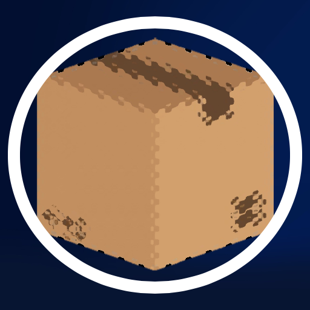
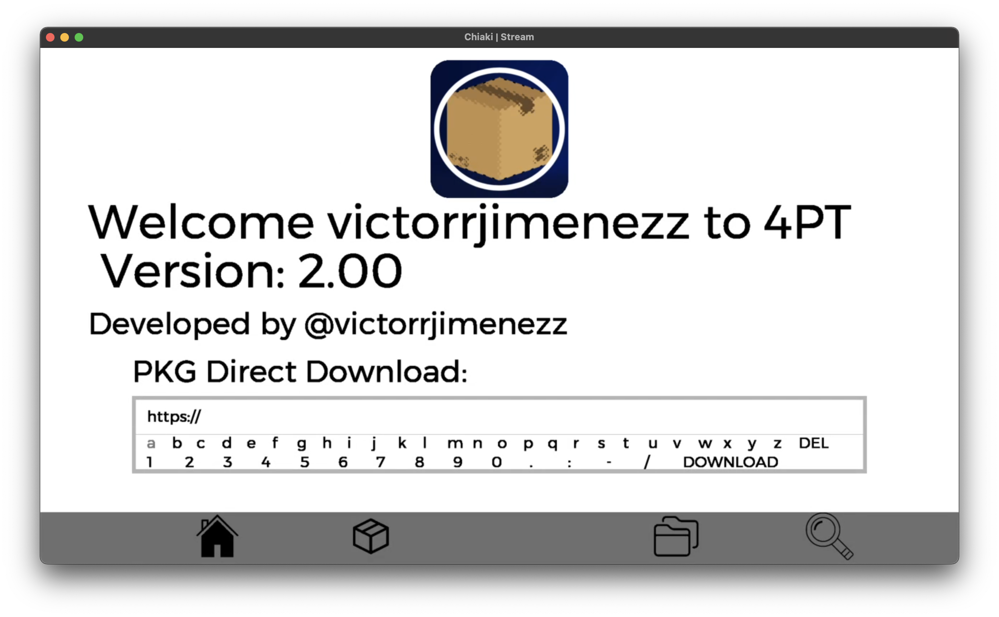
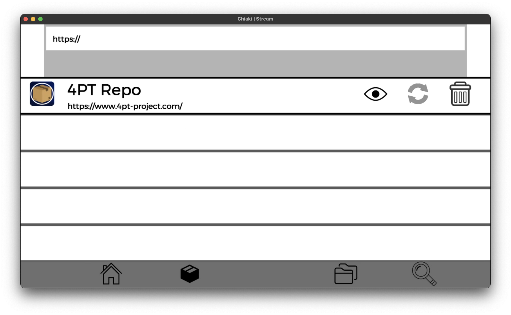
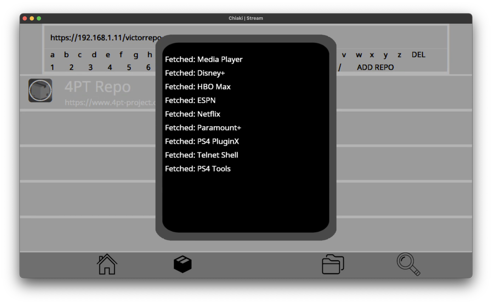
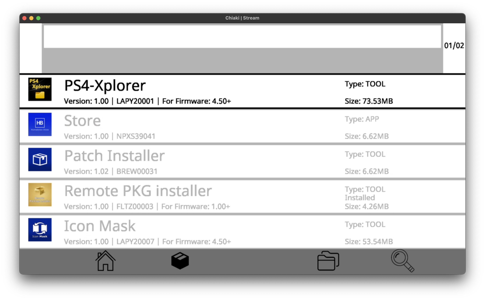
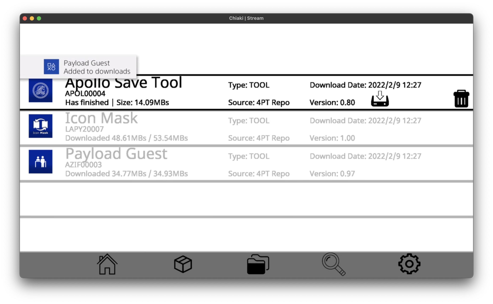
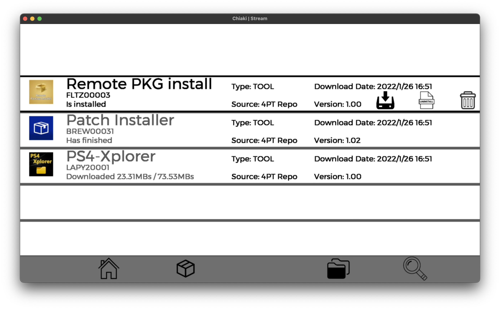
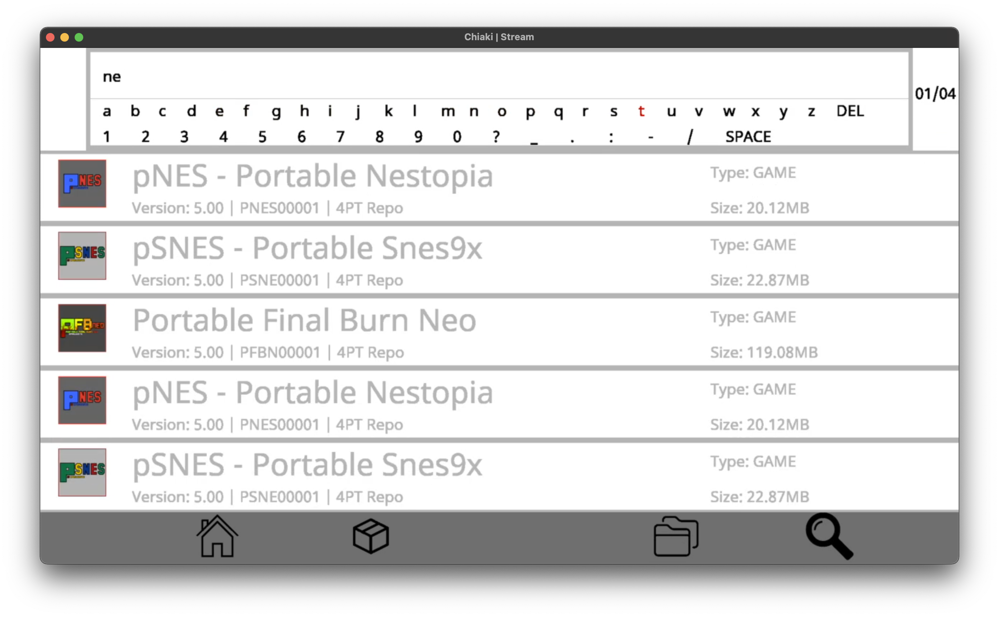
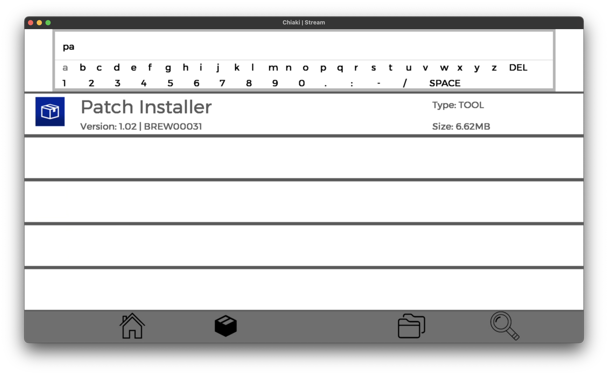

<!-- PROJECT LOGO -->
 

  

<h3 align="center">4PT: PS4 APT</h3>

  

    An Advanced Packaging Tool for the PS4
     
    <a href="https://github.com/victorrjimenezz/4PT-Repository/issues"><strong>Request Feature / Report Bug</strong></a>
     
     
    <a href="https://www.4pt-project.com">Website</a>
    ·
    <a href="https://github.com/victorrjimenezz/4PT-Repository">4PT Template Repository</a>
    ·
    <a href="https://github.com/victorrjimenezz/4PT-REPO-GUI">4PT Repository GUI</a>
    ·
    <a href="https://github.com/victorrjimenezz/PS4-4PT/blob/master/TUTORIAL.md">App tutorial</a>
  

<!-- TABLE OF CONTENTS -->

  
Table of Contents

  <ol>
    <li>
        <a href="#ata">About The App</a>
      <ul>
        <li><a href="#ss">Screenshots</a></li>
      </ul>
    </li>
    <li><a href="#feat">Features</a></li>
    <li><a href="#usage">Usage</a></li>
    <li>
      <a href="#roadmap">Roadmap</a>
      <ul>
        <li><a href="#st">Short Term</a></li>
        <li><a href="#lt">Long Term</a></li>
      </ul>
    </li>
    <li><a href="#lang">Languages</a></li>
    <li><a href="#buildDep">Build Dependencies</a></li>
    <li><a href="#developers">Developers</a></li>
    <li><a href="#Acknowledgments">Acnkowledgments</a></li>
  </ol>

***

## About The App

There are many great Homebrew Apps/Games available.

This tool was developed in order for PS4 Homebrew users to easily download PKGs without the need of using a computer.

Furthermore, 4PT allows anyone to host their own repository and provide any apps/games they would like to share.

### Screenshots

  
Screenshots

  
  

  
  

  
  

  
  

***

## Features

The current working app features are:

- Downloading PKGs from repositories/directly from a URL
- Ability to pause/resume a download
- Adding/Removing Repositories
- Searching apps, filtering by name and repository
- Install/Uninstall downloaded PKGs
- App has English, Spanish, and German support
- 4PT updates itself automatically

***

## Usage

_For information on how to use the app, refer to [Tutorial](https://github.com/victorrjimenezz/PS4-4PT/blob/master/TUTORIAL.md)_

_For information on creating a repo, please refer to  [4PT-Repository](https://github.com/victorrjimenezz/4PT-Repository)_

***

## Roadmap

### Version 2.5 (~3 Months)

- [X] Change 4PT Stored data path to /data/4PT/
- [X] Optimize Loading Repository Speed, gone from 1.25 Packages per second to 9.12 Packages per second. A 
Repo with 123 packages now takes 13.5 seconds to load, instead of 98 seconds.
- [X] If Repo update fails, do not delete all packages :)
- [X] Filter PKGs by type, updates available
- [X] Implement sorting by size, version, alphabetically...
- [X] Add Animated GIF STBI Reading (Repo/PKG Icons)
- [X] Fix package flicker when rapidly changing selected package
- [X] Implemented custom port support!
- [ ] Add customization options, such as disabling notifications or changing language
- [ ] Fix bug that causes the app to hang on the initializing screen

### Future versions (~1/2 Year)

- [ ] Add functionality to download binaries
- [ ] Save on external HDD
- [ ] get Abstract Class from packageSearch and repoPackageList
- [ ] Fix Hungarian automatic detection
- [ ] Custom Port http connection
- [ ] Add Http Authentication Support
- [ ] Add a new PKG List view where only covers are displayed
- [ ] Change Keyboard to UI IME
- [ ] Download pkgs in the background with DAEMONS
- [ ] Support for more languages

See the [open issues](https://github.com/victorrjimenezz/PS4-4PT/issues) for a full list of proposed features (and known issues).

***

## Languages

The app is available in:
- [X] English
- [X] Hungarian by [Damy](https://github.com/dagadtwok)
- [X] Italian by [@imgiovi](https://www.twitter.com/imgiovi)
- [X] German
- [X] Spanish

To add support for further languages, please [contact me](https://twitter.com/victorrjimenezz) or [open an issue](https://github.com/victorrjimenezz/4PT-Repository/issues)

***

## Build Dependencies

This project is built using the Open Orbis PS4 Toolchain and the Yaml-CPP library.

* [OpenOrbis PS4 Toolchain](https://github.com/OpenOrbis/OpenOrbis-PS4-Toolchain)
* [Yaml-CPP](https://github.com/jbeder/yaml-cpp)

***

## Developers

Víctor Jiménez - [@victorrjimenezz](https://twitter.com/victorrjimenezz) - [victorjimenez@4pt-project.com](mailto:victorjimenez@4pt-project.com)

***

## Acknowledgments

I would like to thank [0x199](https://twitter.com/0x199) for helping me with the SSL issue.

I would like to thank the following developers for the developing following projects, which I used to learn how to perform certain actions:

* [Remote Package Installer](https://github.com/flatz/ps4_remote_pkg_installer) by [Flat_z](https://twitter.com/flat_z)  
&ensp;  &ensp;  &ensp; Learned how to access PS4's native HTTP  
&ensp;  &ensp;  &ensp; Learned how get icon and version from pkgs   
 &ensp;  &ensp;  &ensp; Learned how to install PKGs
* [PS4 Skeleton](https://github.com/Al-Azif/ps4-skeleton) by [Al Azif](https://twitter.com/_AlAzif)  
&ensp;  &ensp;  &ensp; Used his jailbreaking tools to gain root privileges  
  &ensp;  &ensp;  &ensp; Used his notifi class to send notifications
* [PS4 Homebrew Store](https://github.com/LightningMods/PS4-Store) by [LightningMods_](https://twitter.com/lightningmods_)  
&ensp;  &ensp;  &ensp; Used his dialog method to pop dialogs  
&ensp;  &ensp;  &ensp; Learned how to access PS4's native HTTP  
&ensp;  &ensp;  &ensp; Learned how to install PKGs  
* [tiny-ps4-shell](https://github.com/john-tornblom/tiny-ps4-shell) by [John Törnblom](https://github.com/john-tornblom)  
&ensp;  &ensp;  &ensp; Used his method to copy files  
* [OpenOrbis NET_HTTP Sample](https://github.com/OpenOrbis/OpenOrbis-PS4-Toolchain/tree/master/samples/net_http) by [Damián Parrino](https://twitter.com/dparrino)  
&ensp;  &ensp;  &ensp; Used his setSSLCallback method to enable SSL  

And I would like to thank the whole OpenOrbis team for developing the awesome [PS4 Developer toolchain](https://github.com/OpenOrbis/OpenOrbis-PS4-Toolchain)!!
