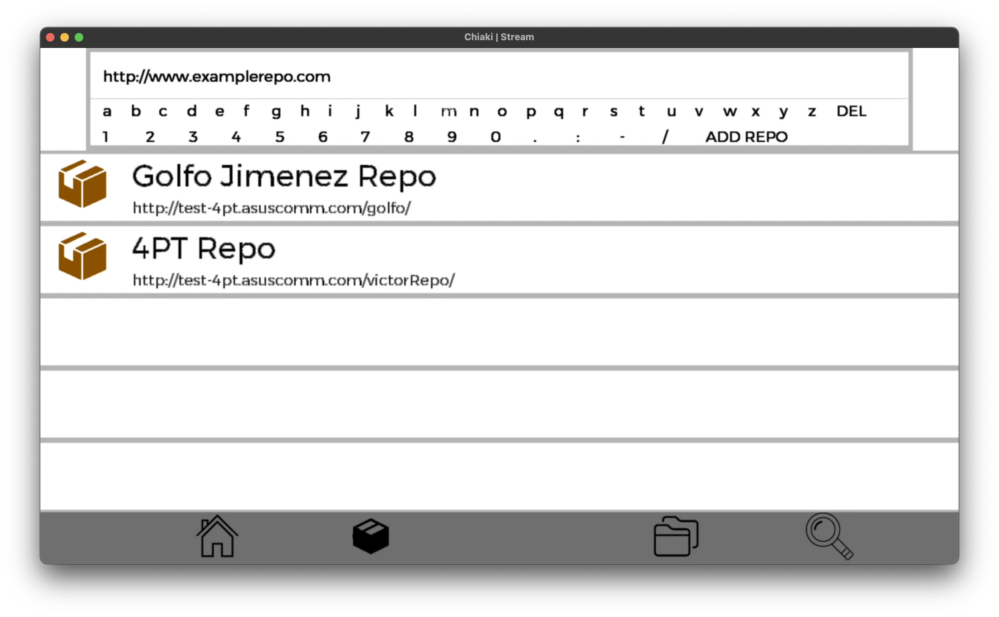

<!-- PROJECT LOGO -->
 

  

<h3 align="center">PS4 APT Package Manager</h3>

  

    A package manager for the PS4. 
     
    <a href="https://github.com/victorrjimenezz/PS4-4PT/issues"><strong>Request Feature / Report Bug</strong></a>
     
     
    <a href="https://github.com/victorrjimenezz/4PT-Repository">4PT Template Repository</a>
    ·
    <a href="https://github.com/victorrjimenezz/PS4-4PT/blob/master/README.md">README</a>
  

<!-- TABLE OF CONTENTS -->

  
Table of Contents

  <ol>
   <li><a href="#sbt">Switching Between Tabs</a></li>
   <li><a href="#aar">Adding a Repository</a></li>
    <li>
        <a href="#dl">Downloads List</a>
      <ul>
        <li><a href="#rd">Pause Download</a></li>
        <li><a href="#pd">Resume Download</a></li>
        <li><a href="#id">Install Download</a></li>
        <li><a href="#ud">Uninstall Download</a></li>
        <li><a href="#rd">Remove Download</a></li>
        <li><a href="#rf">Retry Failed Download</a></li>
      </ul>
    </li>
    <li>
      <a href="#srch">Search</a>
      <ul>
        <li><a href="#gsrch">General Search</a></li>
        <li><a href="#fbrsrch">Filter by Repository Search</a></li>
      </ul>
    </li>
    <li><a href="#pkgdd">PKG Direct Download</a></li>
    <li><a href="#utk">Using the keyboard</a></li>
  </ol>

***

## Switching between tabs

To switch between tabs:

- Press L1 to switch to the left tab.
- Press R1 to swtich to the right tab.

The list of tabs is:
- `Home Tab`
- `Repository Tab`
- `Downloads Tab`
- `Search Tab`

***

## Adding a repository

To add a repository:
 go to the repository tab (2nd one), open the keyboard, type the URL and press Add Repo.

***

## Downloads list

### Pause Download

To pause a download, select it from the downloads list using the up/down arrows, select the pause option by using the right/left arrows,
and press X.

### Resume Download

To resume a download, select it from the downloads list using the up/down arrows, select the resume option by using the right/left arrows,
and press X.

### Install Download

To install a download, select it from the downloads list using the up/down arrows, select the install option by using the right/left arrows,
and press X.

### Uninstall Download

To uninstall a download from the PS4, select it from the downloads list using the up/down arrows,
select the uninstall option by using the right/left arrows, and press X.

***(NOTE: THIS WILL UNINSTALL THE APP FROM THE PS4)***

### Remove Download

To remove a download (from the app and the disk), select it from the downloads list using the up/down arrows,
 select the delete option by using the right/left arrows, and press X.

***(NOTE: THIS WILL NOT UNINSTALL THE APP FROM THE PS4)***

### Retry Failed Download

To retry a failed download, select it from the downloads list using the up/down arrows, select the download option by 
using the right/left arrows, and press X.

***(NOTE: IF THE APP HAD BEEN PARTIALLY DOWNLOADED, THIS WILL RESUME WHERE IT WAS LEFT OFF)***

***

## Search

### General Search

To search a package by its name, from all loaded repositories,
go to the search tab (rightmost one) and type the package name on the keyboard.

### Filter-by-repository Search

<!-- 
-->
To search a package by its name from a specific repository,
go to the repository tab (2nd one) select the repository from which to filter
and, once in the repository package list, open the keyboard and search the package.

## PKG Direct Download

To download a PKG directly from a URL, go to the home tab
(leftmost one), enter the package URL on the keyboard and press download.

***

## Using the keyboard

- To open the keyboard, press triangle.

- To add a key, select it by using the arrows and pressing X on the selected character.

- To delete a key, press X on the DEL option or press square.

